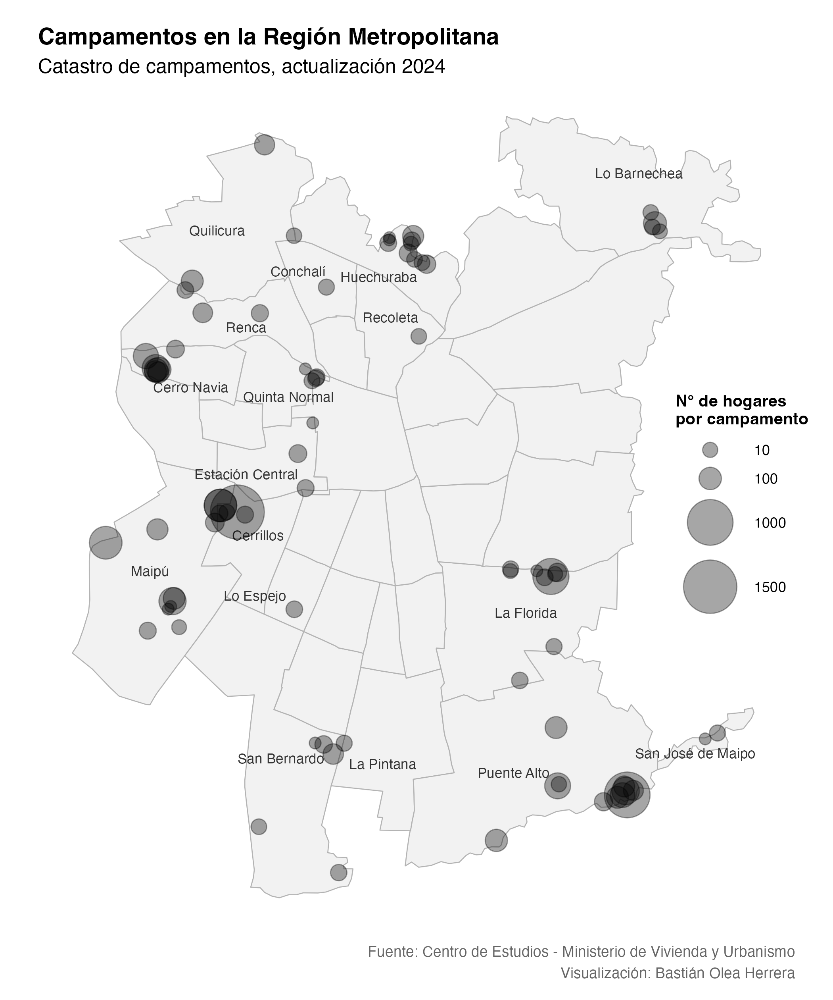

# Mapa de Campamentos 2024 Chile

Este repositorio muestra cómo descargar el Catastro de campamentos nacional 2024, del Ministerio de Vivienda y urbanismo, cargar sus datos en R, y visualizar el mapa como puntos en `{ggplot2}`.

### Fuentes 
- [Actualizacion Catastro campamentos 2024. Ministerio de Vivienda y Urbanismo - Centro de Estudios](https://geoportal-open-data-minvu-2-minvu.hub.arcgis.com/datasets/MINVU::actualizacion-catastro-campamentos-2024-1/about)